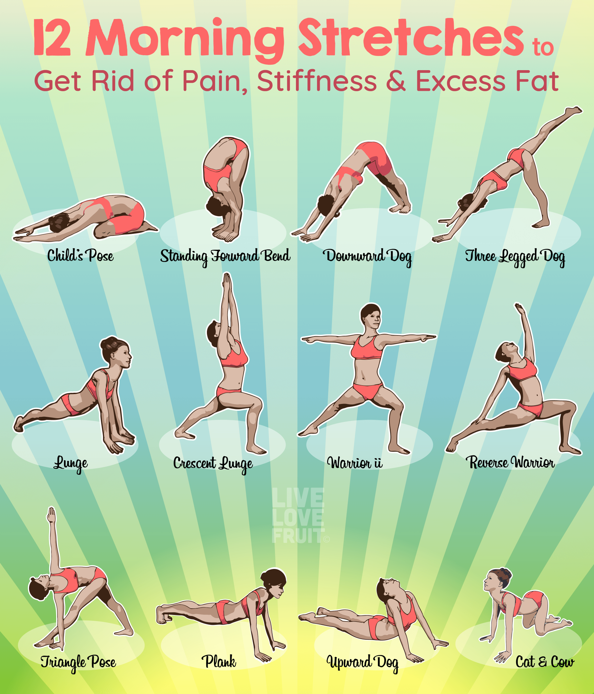

# Stretching / Yoga

<https://www.slideshare.net/ShvetikaKaul/physiology-of-stretching>

## Middle Split Variations

[IG](https://www.instagram.com/reel/C1JEetJP4q2/)

- agonist / antagonist
- contraction / extension
- flexion

## fascial

Fascia is the thin casing of connective tissue that surrounds and holds every organ, blood vessel, bone, nerve fibre and muscle in place. Aside from providing internal structure, it also contains nerves that make it almost as sensitive as your skin, and when it gets stressed, it tightens up. When this happens, it can limit [your mobility](https://apple.news/AgRH8KGeeQza4epOqR4IVlA "‌") and cause painful knots to develop. There are many cases in which someone thinks they’re experiencing muscle pain, when in fact, it’s their fascia that is the real problem.

The good news is, regular movement and [stretching](https://apple.news/A71GE3RzLQHGMeDpTj9vs4g "‌") can prevent the fascia from tightening up and getting “sticky”. This short, simple routine from Watson is a great place to start. Other ways to keep your fascia healthy are regular foam rolling and massage therapy.

[Shoulder](https://www.instagram.com/reel/C-__p0qtATx/)
